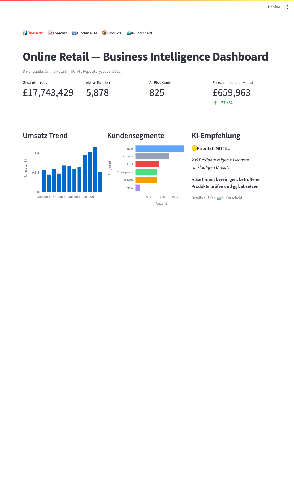
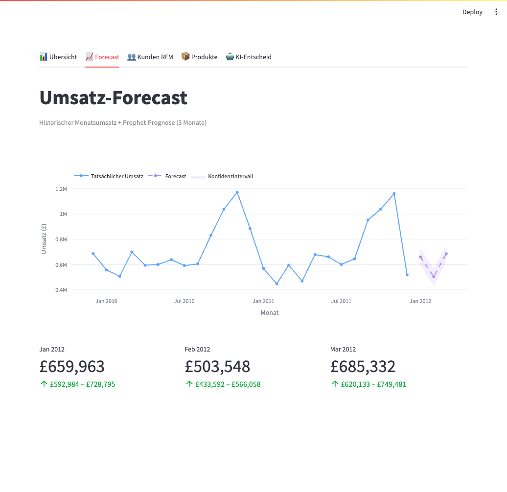
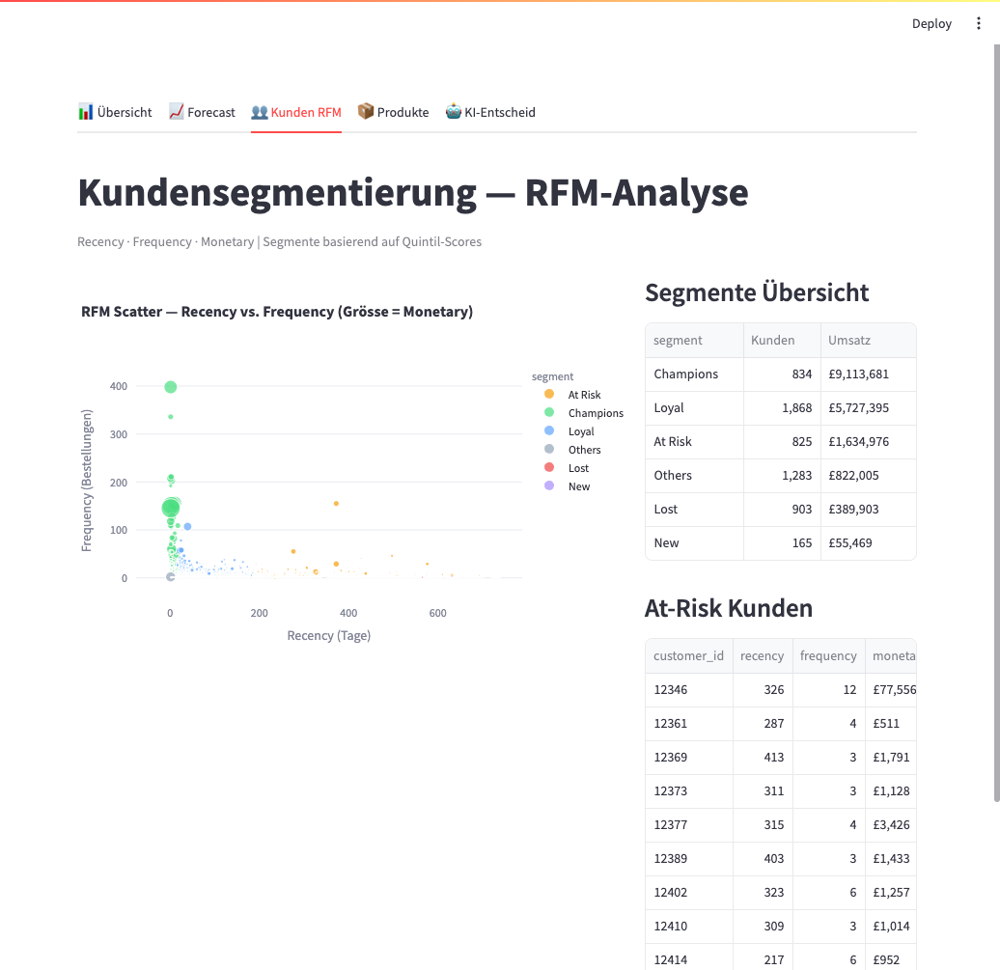
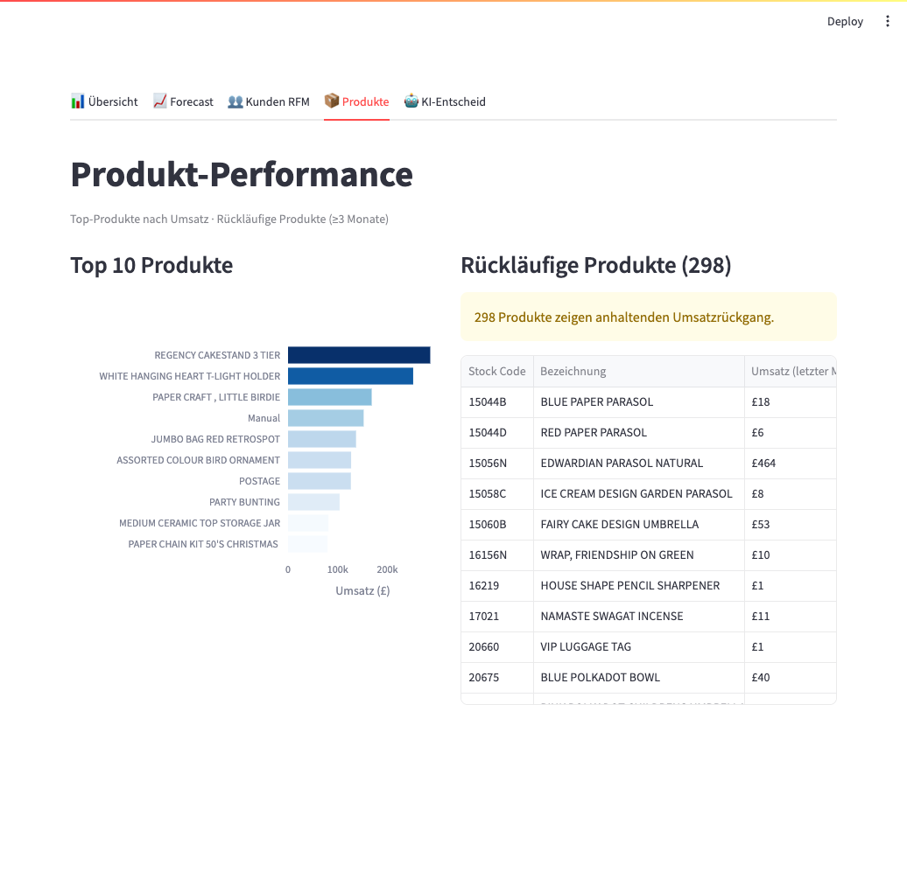
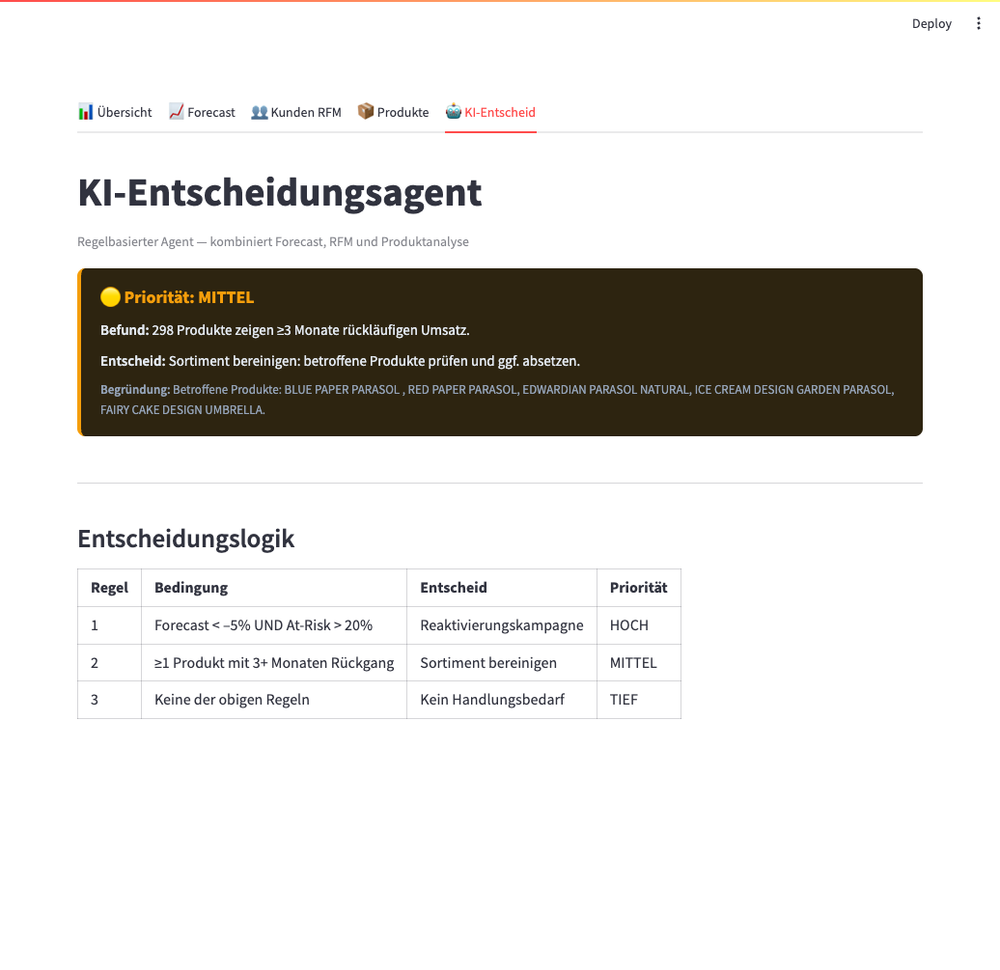

# Entscheidungsagent-BI

Regelbasiertes Business-Intelligence-Dashboard mit KI-Entscheidungsagent für den Online Retail II Datensatz — entwickelt als Abschlussprojekt eines BI-Kurses.

---

## Dataset

**Online Retail II** — UCI Machine Learning Repository
- Link: https://archive.ics.uci.edu/dataset/502/online+retail+ii
- 1.07 Millionen Transaktionen eines britischen Online-Geschenkshops (2009–2011)
- Enthält: InvoiceNo, StockCode, Description, Quantity, InvoiceDate, UnitPrice, CustomerID, Country

---

## Setup (Schritt-für-Schritt)

```bash
# 1. Repository klonen
git clone <repo-url>
cd Entscheidungsagent-BI

# 2. Excel-Datei herunterladen
#    → https://archive.ics.uci.edu/dataset/502/online+retail+ii
#    → Datei speichern als:
mkdir -p data
# data/online_retail_II.xlsx

# 3. Abhängigkeiten installieren
pip install -r requirements.txt

# 4. Dashboard starten (SQLite-DB wird beim ersten Start automatisch generiert)
streamlit run app.py
```

Das Dashboard ist danach unter http://localhost:8501 erreichbar.

---

## Tech-Entscheide

### Python + Streamlit statt R + Shiny

| Kriterium | Python + Streamlit | R + Shiny |
|---|---|---|
| KI-Bibliotheken | Prophet, scikit-learn nativ verfügbar | Wrapper mit Einschränkungen |
| Einheitliche Pipeline | Datenverarbeitung, Modell und UI in einer Sprache | Sprachgrenze zwischen Analyse und App |
| Kurskonsistenz | Week 08 verwendete Python (SimpleAutoencoder.py, Prophet) | Neues Toolset nötig |
| Boilerplate | Minimal — eine Datei reicht fur ein Dashboard | Reaktives Programmiermodell, mehr Setup |
| Portfolio-Relevanz | Python ist Industriestandard fur Data Science und MLOps | Nischenanwendung im akademischen Umfeld |

### SQLite statt MySQL/PostgreSQL

- **Portabel**: Die gesamte Datenbank ist eine einzige `.db`-Datei — kein Server, keine Konfiguration.
- **Auto-generiert**: `build_database()` erstellt und befüllt die DB beim ersten `streamlit run app.py`.
- **Ausreichend**: Fur ein Read-only BI-Dashboard mit einem Datensatz dieser Grösse ist SQLite vollständig ausreichend — keine parallelen Schreibzugriffe nötig.

---

## Architektur

```
Excel (.xlsx)
     |
     v
data_processing.py  ──►  SQLite (.db)
                               |
                               v
                           Pandas DataFrames
                          /        |        \
                         v         v         v
               rfm_analysis  forecasting  product_analysis
               (Segmente)    (Prophet)    (Top/Declining)
                          \        |        /
                           v       v       v
                         decision_agent.py
                         (Regelbasierter KI-Agent)
                               |
                               v
                           app.py
                     (Streamlit Dashboard)
```

---

## Dashboard-Struktur

| Tab | Inhalt |
|---|---|
| Ubersicht | KPI-Metriken (Gesamtumsatz, aktive Kunden, At-Risk-Kunden, Forecast); Umsatz-Trend-Balkendiagramm; Kundensegmente-Übersicht; Top-KI-Empfehlung |
| Forecast | Prophet-Prognose mit historischem Monatsumsatz und 3-Monats-Forecast inkl. Konfidenzintervall; Metric-Cards fur die drei Forecastmonate |
| Kunden RFM | RFM-Scatter-Plot (Recency vs. Frequency, Grösse = Monetary); Segmenttabelle mit Anzahl und Umsatz; Top 10 At-Risk-Kunden |
| Produkte | Top-10-Produkte nach Umsatz (horizontal bar); Liste rückläufiger Produkte (≥3 Monate Rückgang) |
| KI-Entscheid | Alle Empfehlungen des Entscheidungsagenten mit Befund, Entscheid und Begründung; Übersichtstabelle der Entscheidungsregeln |

---

## KI-Entscheidungslogik

Der Entscheidungsagent (`src/decision_agent.py`) kombiniert drei Datenquellen und wendet regelbasierte Logik an:

| Regel | Bedingung | Entscheid | Priorität |
|---|---|---|---|
| 1 | Forecast < -5% UND At-Risk-Anteil > 20% der Kundenbasis | Reaktivierungskampagne fur At-Risk-Kunden starten | HOCH |
| 2 | Mindestens 1 Produkt mit ≥3 Monaten rückläufigem Umsatz | Sortiment bereinigen: betroffene Produkte prüfen und ggf. absetzen | MITTEL |
| 3 | Keine der obigen Regeln trifft zu | Kein unmittelbarer Handlungsbedarf | TIEF |

Die Regeln werden sequenziell geprüft; mehrere Empfehlungen (Regel 1 + 2 gleichzeitig) sind möglich. Jede Empfehlung enthält **Befund**, **Entscheid** und **Begründung** mit konkreten Datenpunkten aus der Analyse.

---

## Screenshots

**Tab 1 — Übersicht**


**Tab 2 — Forecast**


**Tab 3 — Kunden RFM**


**Tab 4 — Produkte**


**Tab 5 — KI-Entscheid**

